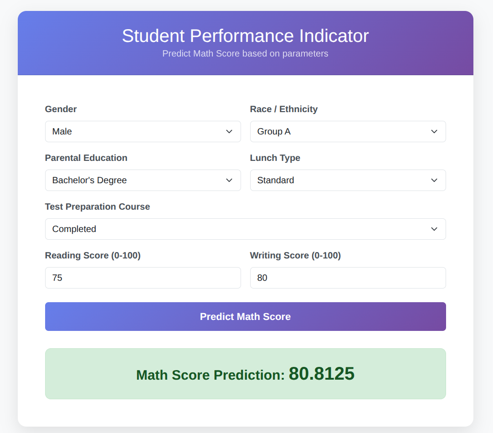

# Student Performance Indicator

## 📌 Project Overview
The **Student Performance Indicator** is an End-to-End Machine Learning project designed to understand how a student's performance (specifically **Math Score**) is affected by other variables such as **Gender**, **Ethnicity**, **Parental Level of Education**, **Lunch**, and **Test Preparation Course**.

This project implements a complete pipeline including Data Ingestion, Data Transformation, Model Training, and a web-based Frontend using **Flask** for real-time predictions.

---

## 📝 Table of Contents
- [Project Overview](#-project-overview)
- [Project Structure](#-project-structure)
- [Technologies Used](#-technologies-used)
- [Dataset](#-dataset)
- [Installation](#-installation)
- [Usage](#-usage)
- [Screenshots](#-screenshots)
- [Model Training Pipeline](#-model-training-pipeline)
- [Author](#-author)

---

## 📂 Project Structure
```text
├── artifacts/                  # Stores generated files (Model, Preprocessor, Train/Test data)
├── notebook/
│   ├── data/                   # Dataset folder (place stud.csv here)
│   ├── 1. EDA STUDENT PERFORMANCE.ipynb    # Exploratory Data Analysis
│   └── 2. MODEL TRAINING.ipynb             # Model experimentation
├── src/
│   ├── components/             # Core ML scripts (Ingestion, Transformation, Training)
│   ├── pipeline/               # Prediction pipeline for the web app
│   ├── utils.py                # Helper functions (save/load objects)
│   ├── logger.py               # Custom logging setup
│   ├── exception.py            # Custom exception handling
│   └── app.py                  # Flask Web Application main file
├── templates/                  # HTML Templates for the UI
│   ├── index.html              # Landing page
│   └── home.html               # Prediction form page
├── requirements.txt            # List of dependencies
├── setup.py                    # Package setup configuration
└── README.md                   # Project documentation

```

---

## 🛠 Technologies Used

* **Programming Language:** Python 3.8+
* **Web Framework:** Flask
* **Machine Learning:** Scikit-Learn, XGBoost, CatBoost, Dill
* **Data Processing:** Pandas, NumPy
* **Visualization:** Matplotlib, Seaborn
* **Frontend:** HTML5, CSS3, Bootstrap 5

---

## 📊 Dataset

The dataset used is the **Student Performance in Exams** dataset.

* **Source:** [Kaggle](https://www.kaggle.com/spscientist/students-performance-in-exams) (or local file)
* **Location:** Ensure the file `stud.csv` is placed inside `notebook/data/`.

---

## ⚙️ Installation

Follow these steps to set up the project locally:

### 1. Clone the Repository

```bash
git clone [https://github.com/yourusername/student-performance-ml.git](https://github.com/yourusername/student-performance-ml.git)
cd student-performance-ml

```

### 2. Create a Virtual Environment

```bash
conda create -p venv python==3.10 -y
conda activate ./venv

```

*(Or using standard python: `python -m venv venv` and `source venv/bin/activate`)*

### 3. Install Dependencies

```bash
pip install -r requirements.txt

```

> **Note:** If you encounter errors with CatBoost, ensure you are using a compatible version of Scikit-learn (e.g., `scikit-learn==1.5.2`) as specified in the requirements.

---

## 🚀 Usage

### 1. Run Data Ingestion & Model Training

Before running the app, you must process the data and train the model. This script will generate the `artifacts` folder containing `model.pkl` and `preprocessor.pkl`.

```bash
python src/components/data_ingestion.py

```

### 2. Start the Web Application

Run the Flask app to start the server:

```bash
python src/app.py

```

### 3. Access the App

Open your browser and navigate to:
`http://127.0.0.1:5000/`

---

## 📸 Screenshots

### 1. Landing Page
*The entry point of the application.*

### 2. Prediction Form
*User inputs student details (Gender, Ethnicity, Scores, etc.).*

### 3. Prediction Result
*The model displays the predicted Math Score.*



---

## 🧠 Model Training Pipeline

The training process involves three main stages:

1. **Data Ingestion:**
* Reads the `stud.csv` data.
* Splits the data into Training and Testing sets.
* Saves the raw files in the `artifacts` folder.


2. **Data Transformation:**
* Handles missing values (Imputation).
* Encodes categorical variables (One-Hot Encoding).
* Scales numerical features (Standard Scaling).
* Saves the `preprocessor.pkl` object.


3. **Model Trainer:**
* Trains multiple models (Random Forest, Decision Tree, XGBoost, CatBoost, etc.).
* Evaluates them based on R2 Score.
* Selects the best performing model and saves it as `model.pkl`.


---

## 👤 Author

**Aman Verma**

* Email: amanverma1067@gmail.com
* GitHub: [amanverma1067](https://www.google.com/search?q=https://github.com/amanverma1067)
